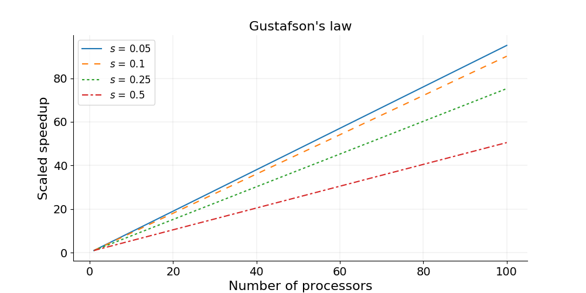
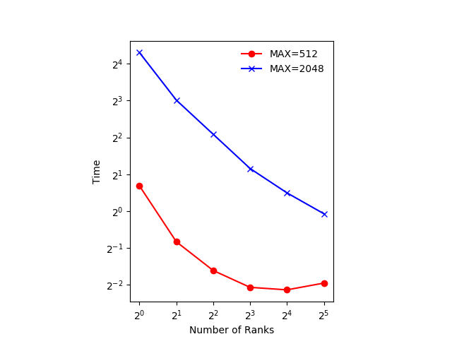
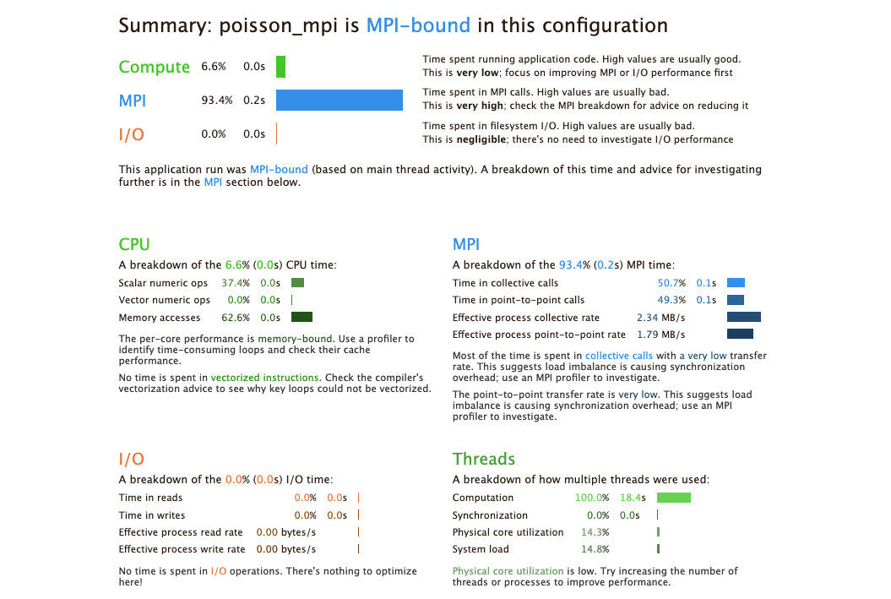

Now we have some parallelised code, we may want to consider optimising it to make more efficient use of its parallelisation.
But before we do that, it's really helpful to understand how well our code *scales* as we increase the resources available to it, and importantly, *where* we need to optimise.

## Characterising the Scalability of Code

The speedup when running a parallel program on multiple processors can be defined as:

$$ \mathrm{speedup} = t_1 / t_N $$

where $$t_1$$ is the computational time for running the software using one processor, and $$t_N$$ is the computational time running the same software with N processors.

- Ideally, we would like software to have a linear speedup that is equal to the number of processors (speedup = N), as that would mean that every processor would be contributing 100%  of its computational power.
- Unfortunately, this is a very challenging goal for real applications to attain.

### Amdahl's Law and Strong Scaling

There is a theoretical limit in what parallelization can achieve, and it is encapsulated in "Amdahl's Law":

$$ \mathrm{speedup} = 1 / (s + p / N) $$

where $$s$$ is the proportion of execution time spent on the serial part, $$p$$ is the proportion of execution time spent on the part that can be parallelized, and $$N$$ is the number of processors.
Amdahl’s law states that, for a fixed problem, the upper limit of speedup is determined by the serial fraction of the code - most real world applications have some serial portion or unintended delays (such as communication overheads) which will limit the code’s scalability. 
This is called **strong scaling** and its consequences can be understood from the figure below.


::::callout
## Amdahl's law in practice

Consider a program that takes 20 hours to run using one core.
If a particular part of the program, which takes one hour to execute, cannot be parallelized (s = 1/20 = 0.05), and if the code that takes up the remaining 19 hours of execution time can be parallelized (p = 1 − s = 0.95), then regardless of how many processors are devoted to a parallelized execution of this program, the minimum execution time cannot be less than that critical one hour.
Hence, the theoretical speedup is limited to at most 20 times (when N = ∞, speedup = 1/s = 20).
::::

#### Strong scaling

- Defined as how the solution time varies with the number of processors for a *fixed total problem size*.
- Linear **strong** scaling if the speedup (work units completed per unit time) is equal to the number of processing elements used.
- Harder to achieve good strong-scaling at larger process counts since communication overhead typically increases with the number of processes used.

In practice the sizes of problems scale with the amount of available resources, and we also need a measure for a relative speedup which takes into account increasing problem sizes.

### Gustafson's law and weak scaling

Gustafson’s law is based on the approximations that the parallel part scales linearly with the amount of resources, and that the serial part does not increase with respect to the size of the problem.
It provides a formula for scaled speedup:

$$ \mathrm{scaled\ speedup} = s + p × N $$

where $$s$$, $$p$$ and $$N$$ have the same meaning as in Amdahl's law.
With Gustafson's law the scaled speedup increases linearly with respect to the number of processors (with a slope smaller than one), and there is no upper limit for the scaled speedup.
This is called **weak scaling**, where the scaled speedup is calculated based on the amount of work done for a scaled problem size (in contrast to Amdahl’s law which focuses on fixed problem size).



**Weak scaling** is defined as how the solution time varies with the number of processors for a *fixed problem size per processor*.
If the run time stays constant while the workload is increased in direct proportion to the number of processors, then the solution is said to exhibit *linear weak scaling*.


## Communication Speed and Latency

The other significant factors in the speed of a parallel program are communication speed and latency.

Communication speed is determined by the amount of data one needs to send/receive, and the bandwidth of the underlying hardware for the communication.
Latency consists of the software latency (how long the operating system needs in order to prepare for a communication), and the hardware latency (how long the hardware takes to send/receive even a small bit of data).

For a fixed-size problem, the time spent in communication is not significant when the number of ranks is small and the execution of parallel regions gets faster with the number of ranks. 
But if we keep increasing the number of ranks, the time spent in communication grows when multiple cores are involved with communication.

## Surface-to-Volume Ratio

In a parallel algorithm, the data which is handled by a core can be considered in two parts: the part the CPU needs that other cores control, and a part that the core controls itself and can compute.
The whole data which a CPU or a core computes is the sum of the two.
The data under the control of the other cores is called "surface" and the whole data is called "volume".

The surface data requires communications.
The more surface there is, the more communications among CPUs/cores is needed, and the longer the program will take to finish.

Due to Amdahl's law, you want to minimize the number of communications for the same surface since each communication takes finite amount of time to prepare (latency).
This suggests that the surface data be exchanged in one communication if possible, not small parts of the surface data exchanged in multiple communications.
Of course, sequential consistency should be obeyed when the surface data is exchanged.


## How Does our Code Scale?

FIXME: back reference to last episode (and serial and parallel regions bit) as a lead-in

Try it with a different numbers of ranks, up to the maximum number you expect to use.

It's also good to check the speed with just one rank. 
In most cases it can be made as fast as a serial code using the same algorithm.

FIXME: adapt next paragraph to discuss testing in general

When making changes to improve performance, keep running the test suite.
There is no reason to write a program that is fast but produces wrong results.

:::::challenge{id=strong-scaling, title="Strong Scaling"}
Strong scaling means increasing the number of ranks without changing the problem.
An algorithm with good strong scaling behaviour allows you to solve a problem more and more quickly by throwing more cores at it.
There are no real problems where you can achieve perfect strong scaling but some do get close.

Modify the main function to call the `poisson_step` 100 times and set `GRIDSIZE=512`.

Try running your program with an increasing number of ranks.
Measure the time taken using the Unix `time` utility.
What are the limitations on scaling?

::::solution
Exact numbers depend on the machine you're running on, but with a small number of ranks (up to 4) you should see the time decrease with the number of ranks.
At 8 ranks the result is a bit worse and doubling again to 16 has little effect.

The figure below shows an example of the scaling with `GRIDSIZE=512` and `GRIDSIZE=2048`.



In the example, which runs on a machine with two 20-core Intel Xeon Scalable CPUs, using 32 ranks actually takes more time.
The 32 ranks don't fit on one CPU and communicating between the the two CPUs takes more time, even though they are in the same machine.

The communication could be made more efficient.
We could use non-blocking communication and do some of the computation while communication is happening.
::::
:::::


:::::challenge{id=weak-scaling, title="Weak Scaling"}
Weak scaling refers to increasing the size of the problem while increasing the number of ranks.
This is much easier than strong scaling and there are several algorithms with good weak scaling.
In fact our algorithm for integrating the Poisson equation might well have perfect weak scaling.

Good weak scaling allows you to solve much larger problems using HPC systems.

Run the Poisson solver with and increasing number of ranks, increasing `GRIDSIZE` only in the `j` direction with the number of ranks.
How does it behave?

::::solution
Depending on the machine you're running on, the runtime should be relatively constant.
Runtime will increase if you need to use nodes that are further away from each other in the network.

The figure below shows an example of the scaling with `GRIDSIZE=128*n_ranks`.
This is quickly implemented by settings `my_j_max` to `128`.


In this case all the ranks are running on the same node with 40 cores.
The increase in runtime is probably due to the memory bandwidth of the node being used by a larger number of cores.
::::
:::::

## Profiling our Code

> "We should forget about small efficiencies, say about 97% of the time:
> premature optimization is the root of all evil." -- Donald Knuth

Essentially, before attempting to optimize your own code, you should profile it.
Typically, most of the runtime is spent in a few functions/subroutines, so you should focus your optimization efforts on those parts of the code. 
The good news is that there are helpful tools known as *profilers* that can help us.

Profilers help you find out where a program is spending its time and pinpoint places where optimising it makes sense. 
Many different types of profiling tools exist, but for MPI application we need **parallel profilers**.

Some examples of parallel profilers are:
- [Scalasca](http://scalasca.org) - a free and open source parallel profiler developed by three German research centers.
- [CrayPat](https://pubs.cray.com/content/S-2376/7.0.0/cray-performance-measurement-and-analysis-tools-user-guide/craypat) - performance analysis tool offered by Cray for the XC platform.
- [TAU](https://www.cs.uoregon.edu/research/tau/home.php)
- [VAMPIR](https://vampir.eu/)
- [Paraver](https://tools.bsc.es/paraver)

In this lesson we will use a simple tool called ARM Performance Reports which gives us an overview of how much time is spent in compute, MPI calls and I/O.
Performance Reports is part of the ARM Forge (formerly Allinea Forge) suite of tools for parallel applications and is developed by the semiconductor and software design company ARM.

The suite also comes with a debugger (ARM DDT) and a profiler (ARM MAP).
ARM MAP is a more advanced tool which allows the user to see how much time each individual line of code takes, and why.
ARM DDT supports a wide range of parallel architectures and models, including MPI, UPC, CUDA and OpenMP.

Version 19 and higher of ARM Forge supports Python, in addition to Fortran and C/C++.

To see what versions of Allinea your HPC

### Further Information

For more information on ARM Forge check the [product website](https://www.arm.com/products/development-tools/server-and-hpc/forge). 


## Performance Reports

FIXME: adapt section for DiRAC

It is advisable to create a short version of your program, limiting the runtime to a few seconds or minutes.
You may be able to reduce the problem size or required precision, as long as this does not change the algorithm itself.

We will use the Poisson solver from the previous lesson as an example.
The example program used here (and at the end of the previous section)
is:
[here](code/poisson/poisson_profiling.c)(C version) or
[here](code/poisson/poisson_profiling.F08)(Fortran version).

We first load the module for Performance Reports:

```bash
module load allinea-reports/18.1.1
```


Assuming the final version is saved into `poisson.c` it is compiled with:
```bash
mpicc -o poisson poisson.c
```

Assuming the final version is saved into `poisson.F08` it is compiled with:
```bash
mpifort -o poisson poisson.F08
```


Next, we run the executable using Performance Reports to analyse the program execution:
```bash
perf-report mpirun -n 16 poisson
```

This creates two files, one .txt file which can be viewed in the
terminal and one .html file which can be opened in a browser.
```bash
cat poisson_16p_1n_2019-11-26_09-37.txt
```

```
Command:        mpirun -n 16 ./poisson
Resources:      1 node (24 physical, 48 logical cores per node)
Tasks:          16 processes
Machine:        tegner-login-1.pdc.kth.se
Start time:     Tue Nov 26 2019 09:37:22 (UTC+01)
Total time:     1 second
Full path:      /cfs/klemming/nobackup/k/kthw/introduction-to-mpi

Summary: poisson is MPI-bound in this configuration
Compute:                                     35.0% |===|
MPI:                                         65.0% |======|
I/O:                                          0.0% |
This application run was MPI-bound. A breakdown of this time and advice for investigating further is in the MPI section below.

...
```

The graphical output looks like this:



The output shows that when run in this way, the application is MPI bound, i.e. most time is spent in MPI communication.
This typically means that the application does not scale well to the given number of processes.
Either the number of processes should be decreased, or the problem size increased so that more time is spent in the actual compute sections of the code.

:::::challenge{id=profile-poisson, title="Profile Your Poisson Code"}
Compile, run and analyse your own MPI version of the poisson code.
 
How closely does it match the performance above? What are the main differences?
Try reducing the number of processes used, rerun and investigate the profile.
Is it still MPI-bound? 
 
Increase the problem size, recompile, rerun and investigate the profile.
What has changed now?
:::::

:::::challenge{id=iterative-improvement, title="Iterative Improvement"}
In the Poisson code, try changing the location of the calls to `MPI_Send`.
How does this affect performance?
:::::

### ARM MAP

After getting a general overview of the performance through ARM Performance Reports, one can start digging deeper using a full-fledged profiler like ARM MAP.
We will not go into any details on using MAP, but instead just show how MAP can be used.

#### Installing the Remote Client

First, it's useful to install the [ARM Forge Remote Client](https://developer.arm.com/tools-and-software/server-and-hpc/arm-architecture-tools/downloads/download-arm-forge), as this avoids running the GUI over a possibly slow or unstable ssh connection.
The remote client runs on your local computer and can be used to connect to running processes on the cluster.

After downloading an installer for your operating system (link above), you need to set up the connection to PDC:

- Click "Remote Launch", and select "Configure"
- Click "Add", and for "hostname" write: <username>@tegner.pdc.kth.se.
  You can also give an optional Connection name.
- For "Remote installation directory", enter `/pdc/vol/allinea-forge/19.1.3/amd64_co7/`
- Click on "Test Remote Launch" to see if the Remote Client GUI can successfully connect to Tegner.

If connecting fails, you may need to replace the default ssh used by Remote Client. First create the directory `~/.allinea`. 
In this directory create a file called `remote-exec`. In this file, write:

```bash
#!/bin/sh /correct/path/to/ssh [correct flags] $*
```

Note that:
- If you are on OSX with an ssh installed via MacPorts, the correct ssh would be `/opt/local/bin/ssh`.
- If you have not configured your `~/.ssh/config` file, you will need to add the flags `GSSAPIDelegateCredentials=yes -o GSSAPIKeyExchange=yes -o GSSAPIAuthentication=yes`


:::::challenge{id=profiling-with-map, title="Profiling with MAP"}
First install and configure the ARM Forge Client according to the instructions above.
Then, open the Remote Client and click `ARM MAP` from the left panel, and click `Profile` in the main panel. 
 
In the window that pops up, select which Application you want to profile and the number of MPI ranks.
Tick "Submit to Queue", and click "Configure" and make sure that the fields look correct.
Under "Metrics", disable Energy, I/O, Lustre.

Now click "Submit", and see how a job is launched.
:::::

## A General Optimisation Workflow

A general workflow for optimising a code, whether parallel or serial, is as follows:

1. Profile
2. Optimise
3. Test correctness
4. Measure efficiency

Then we can repeat this process as needed. But note that eventually this process will yield diminishing returns, 
and over-optimisation is a trap to avoid - hence the importance of continuing to measure efficiency as you progress.
