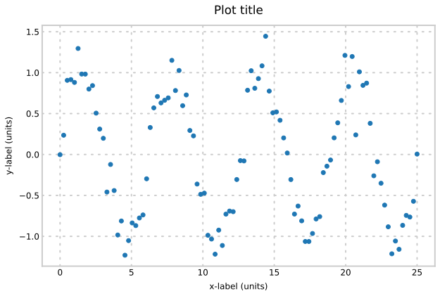
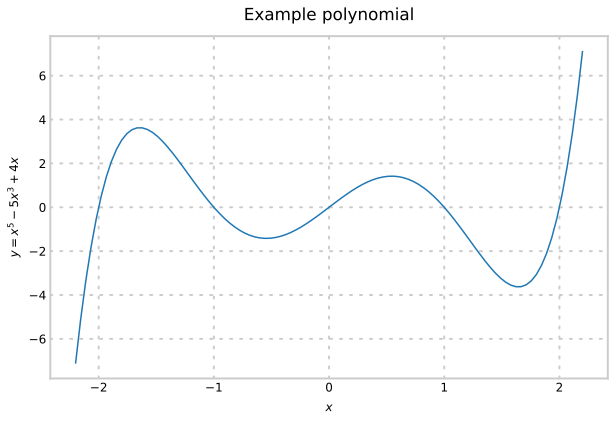
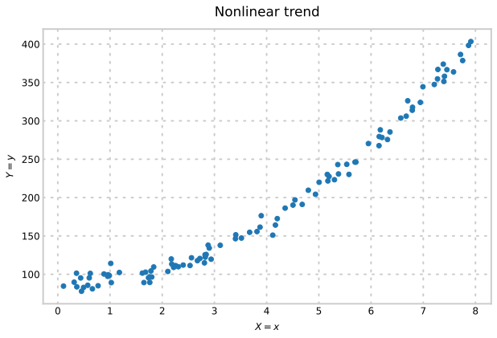
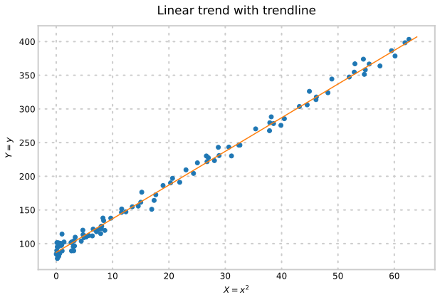
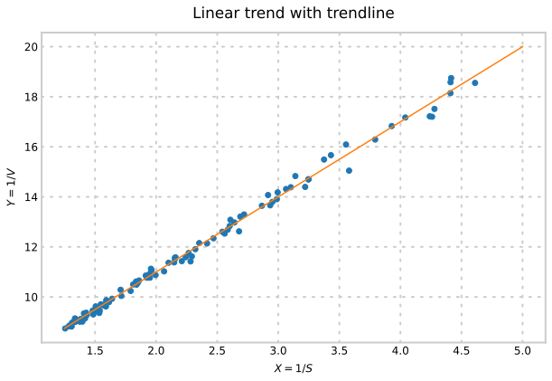

## Basics

Terminology:

- $Y$ or $y$ is the *dependent* variable, sometimes called the *ordinate*
  marked on the vertical axis
- $X$ or $x$ is the *independent* variable, sometimes called the *abscissa*
  marked on the horizontal axis
- The dependent variable is said to be graphed *against* the independent
  variable

Essential Features:

- Title
- Axis labels (and units if appropriate)

## Equation of a straight line

Defined by a gradient, $m$, and a $y$-axis intercept, $c$:

$$y = m x + c$$

Interpretation:

- The intercept of this line on the $y$ axis is given by $y=c$, since at $x=0$,
  $y = c$

- The gradient of this line (also called its "slope") is given by
  $$m = {y_2-y_1\over x_2 - x_1}$$
  ("change in $y$ divided by change in $x$")

- The intercept of this line on the $x$ axis is given by $x = -{c \over m}$,
  since at $y=0$ we must have $mx=-c$

## Graphs of Polynomials

An expression involving higher powers of $x$ is called a *polynomial* in $x$.

### Example

$y=x^5-5x^3+4x$

### In general

$$y = a_n x^n + a_{n-1} x^{n-1} + a_{n-2} x^{n-2}+\ldots+a_1 x^1 + a_0x^0$$

The graph of a polynomial of degree $n$ has at most $n-1$ bends in it.

## Transforming from non-linear to linear

If we wish to test visually whether some data fit a particular relationship, we can transform the data to plot something which should be linear if the relationship holds.

### e.g. Test for *parabolic* shape for data in $(x,y)$: i.e. $y = x^2$

- We can plot $Y$ against $X$ where we let $Y=y$ and $X=x^2$.

#### First plot the original data
There's a definite curve, and we may suspect the trend is quadratic

#### Now plot the data nonlinearly

If the parabolic relationship holds, plotting $Y=y$ against $X=x^2$ should result in a straight line.

#### Calculate the gradient and the intercept

We next add a trendline through these points which we can use to determine the gradient and intercept.

- We find $(X,Y)$ lie along a straight line with slope 5 and Y-intercept 87.

- This means that $Y=5X+87$

- So, $y$ and $x$ can be modelled by the polynomial equation $y=5x^2+87$.

## Example from biosciences

The rate at which a given enzyme can catalyse a reaction can be dependent upon the substrate concentration:
$${1\over V} = {m\over S} + c$$

where $V$ is the rate of the reaction, $S$ is the substrate concentration and
$m$ and $c$ are constants.

- We can derive a straight line graph from the above formula by plotting
  $Y=1/V$ against $X=1/S$

- It will have gradient $m$ and ordinate intercept $c$

First, plot the original data which is observations of $V$ given varying $S$:

#### Now plot the data nonlinearly

If the hypothesised relationship holds, plotting $Y=1/V$ against $X=1/S$ should result in a straight line.

#### Calculate the gradient and the intercept

We next add a trendline through these points which we can use to determine the gradient and intercept.

- We find $(X,Y)$ lie along a straight line with slope 3 and Y-intercept 5.

- This means that $Y=3X+5$

- So, $V$ and $S$ can be modelled by the equation $1/V=3/S+5$.
